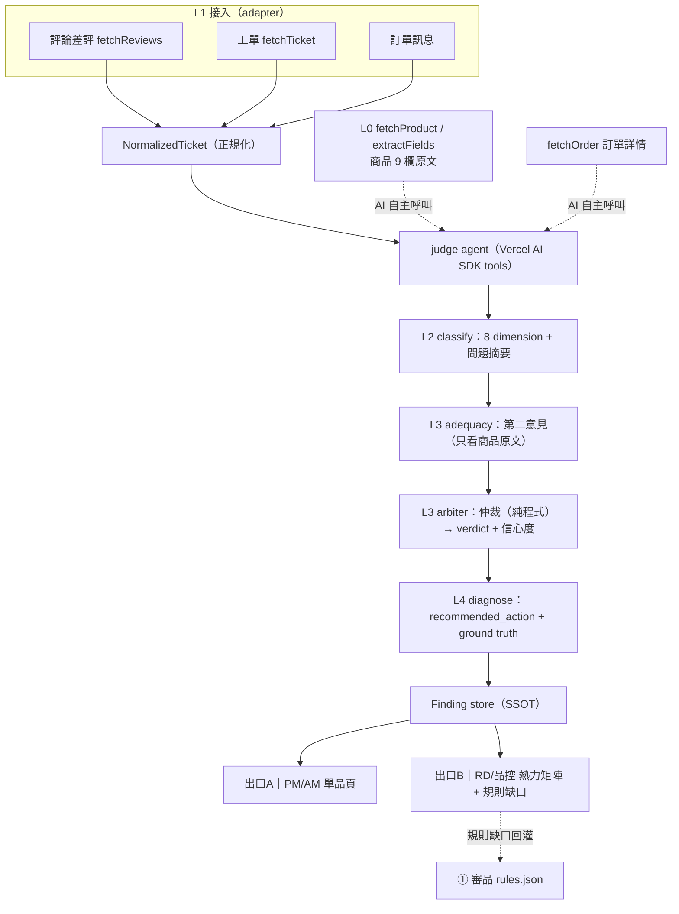

# kkday-ai-product-quality — 完整架構

> AI 法官（內容爭議裁決系統）· 內容質量 Pod 第三支柱 · 獨立 repo（Vue3 + Node + ECharts）
> 邏輯參照 folder 2117435397（工單驅動審核 L0–L5）+ AI 法官主頁五層架構；技術實作為前端 Vue3/Arco（Node 工具鏈）+ 後端 Python（FastAPI，沿用 ProductContentAIChecker 判決資產）。
> 技術選型見 [docs/TECH-STACK.md](./docs/TECH-STACK.md)。

## 1. 定位與目標

**做什麼**：把客訴/差評/工單等真實負面訊號，自動歸因到「**哪個商品的哪個欄位該改**」，產出可執行 action 給 AM/PM，並反推「哪條審核規則最該優先」。
**北極星**：降低售後進線的內容類占比。
**與既有兩支柱關係**：① AI 審品（事前預防）、② AI 撰寫（編輯輔助）、③ AI 法官（事後裁決）共用同一份內容治理法典；本 repo 只做第三支柱。

## 2. 核心架構：Function-Calling Agent ＋ L0–L5 Pipeline

兩個設計支柱：
1. **Pipeline 骨架（folder SD 的 L0–L5）**：穩定、可測、單向資料流，Finding 為 SSOT。
2. **Function-Calling 撈證（Gary 構想）**：判決過程中，AI 依需要自主呼叫 tools（order/review/product API）補足證據，再判 → 證據更全、判更準。



## 3. 判決引擎（兩階段 + 雙意見 + verdict 五分類）

- **Stage 1 確定性層**：跑命中欄位的可機判規則（schema/格式/明確矛盾）→ 命中即高信心。
- **Stage 2 法典推理層**：LLM 對照 8 dimension 法典裁決。
- **雙意見交叉**（準確性核心）：
  - classify（只看客訴/差評）→ 疑似 dimension + 欄位 + 初判
  - adequacy（只看商品欄位原文、不採信抱怨）→ adequate/unclear/missing/contradictory
  - arbiter（**純程式仲裁**，非 LLM）→ 最終 verdict + 信心度
- **verdict 五分類**：
  | verdict | 進 PM 修改清單 | 意義 |
  |---|---|---|
  | `real_config_issue` | ✅ | 設定寫錯/矛盾 |
  | `content_missing` | ✅ | 該講沒講 |
  | `content_unclear` | ✅ | 模糊易誤解 |
  | `customer_misread` | ❌ | 其實寫清楚了（UX 洞察）|
  | `escalate_ops` | ❌ | 服務/出貨等非內容 |
- **信心度路由**：高 → 可自動 action；低 → 轉人工 + 沉澱 golden。高信心誤判代價最高，門檻寧保守。

## 4. Function Calling 設計（tools）

每個資料源包成一個 OpenAI SDK tool（Python function + Pydantic 參數），LLM 自主決定呼叫順序：

| tool | 作用 | 後端來源 |
|---|---|---|
| `fetchReviews({prodId, sort, page})` | 撈差評（RATING_ASC 優先）| Review API |
| `fetchProduct({prodId})` + `extractFields` | 商品 9 欄原文 | api-b2c CDN |
| `fetchOrder({orderId})` | 該客人訂單詳情（履約事實）| order API（待權限）|
| `fetchTicket({ticketId})` | 工單/客服對話 | FreshDesk（6/30）|

判決 prompt 給 agent：「你可用以上 tools 補足判斷所需證據，證據齊備後輸出 TicketFinding。」

## 5. Repo 結構（backend Python + frontend Vue3）

```
kkday-ai-product-quality/
├── backend/                # Python（FastAPI + 判決引擎，沿用 ProductContentAIChecker）
│   ├── requirements.txt
│   ├── fixtures/           # golden（product_150665.json）
│   └── app/
│       ├── main.py         # FastAPI 入口
│       ├── schema.py       # Pydantic TicketFinding
│       ├── ingest/         # L1 adapters（review/ticket）
│       ├── datasource/     # L0 商品欄位 + function-calling tools
│       ├── llm/            # OpenAI SDK client + prompt
│       ├── judge/          # L2 classify / L3 adequacy+arbiter / L4 diagnose
│       ├── rules/          # rules.json（8 dimension）
│       ├── store/          # Finding 持久化（SQLite→PG）
│       └── pipeline/       # 編排：ticket → Finding[]
├── frontend/               # Vue3 + Vite + Arco + ECharts（Node 工具鏈）
│   └── src/
│       ├── pages/          # 出口A 單品頁 / 出口B 品控分析頁
│       ├── components/     # 熱力矩陣 / Finding 卡片
│       ├── stores/         # Pinia
│       ├── api/            # 打後端 REST
│       └── types/          # finding.ts（對應後端 schema）
└── docs/                   # ARCHITECTURE / TECH-STACK / DELIVERY-PLAN
```

## 6. 兩出口 Dashboard（Vue3 + ECharts）

- **出口B｜RD/品控**（進門第一眼）：dimension × verdict **熱力矩陣**（vue-echarts）+ KPI 列 + 下鑽 + **規則缺口面板**（高頻 content_unclear/missing 但無對應規則 → 標紅）。
- **出口A｜PM/AM 單品頁**：選商品 → Finding 依 `suspected_field` 分組 + 每筆卡片（客戶原話 / 頁面 evidence / 客服標準答案 / recommended_action）+ 狀態（確認/忽略/已修）。

## 7. 里程碑

| M | 內容 | 產出 |
|---|---|---|
| **M0** | repo scaffold + 架構 + shared schema | 本次 |
| **M1** | 資料層：fetchReviews/fetchProduct tools + NormalizedTicket（用 150665 真資料）| 可拉真實輸入 |
| **M2** | 判決層：classify→adequacy→arbiter→diagnose（LLM stub→真 LLM，key 6/25）| 產 Finding |
| **M3** | L5 dashboard：兩出口 + ECharts 熱力矩陣 | 可視化 |
| **M4** | 閉環：golden/eval（Promptfoo）+ 信心度 calibration + 規則缺口回灌 | 準確率達標 |

## 8. 部署

- 雲端部署（Gary/Alvin Slack 共識）：後端 Python（FastAPI）容器化 + 前端靜態。
- LLM：OpenAI gpt-5-mini（專案獨立 key，6/25 生效，分專案 token 監控）。可走 AI Gateway 保留多 provider。

## 9. 開放依賴（沿用前期已識別）
- OpenAI key 6/25 · 工單 ingest API 6/30 · order/DB 權限（Gary 申請中）· 信心度門檻 calibration · 評論 production 走內網 Review Service（避 datadome）。
