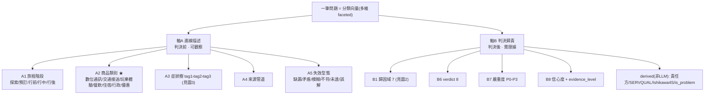
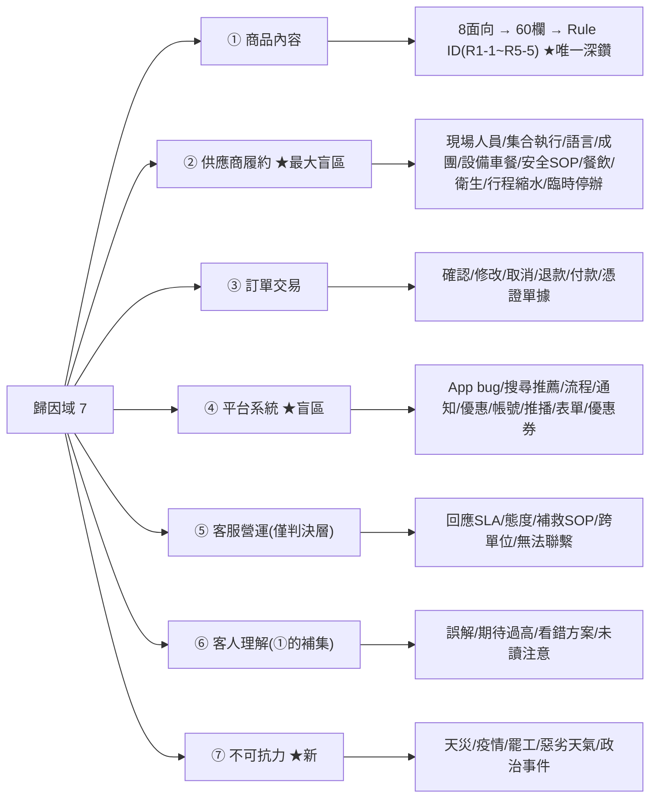
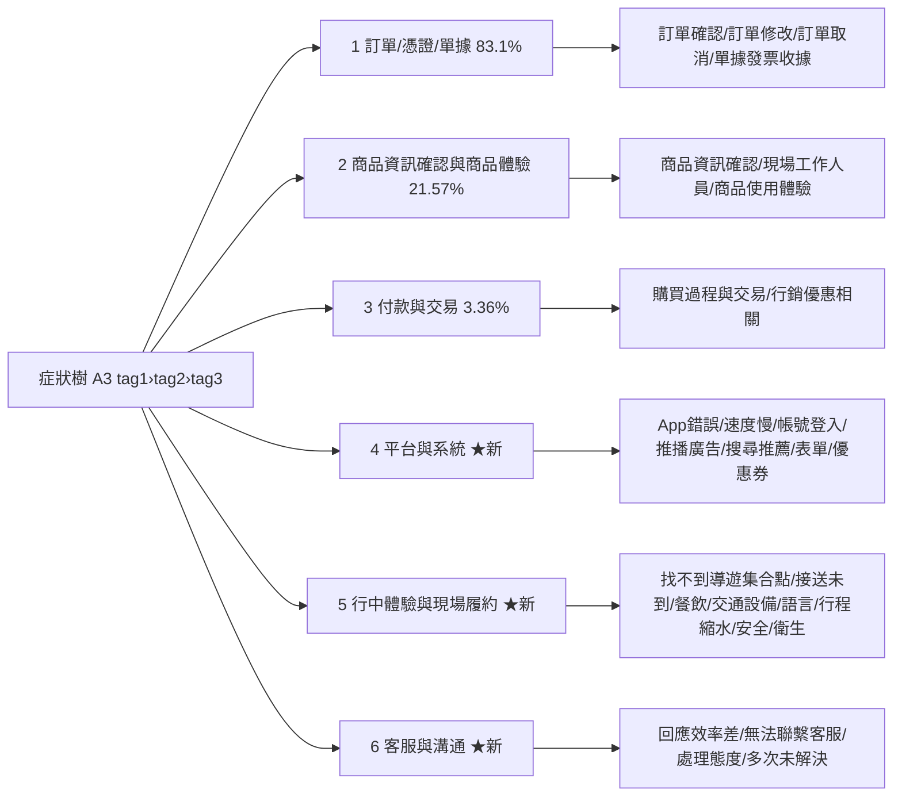
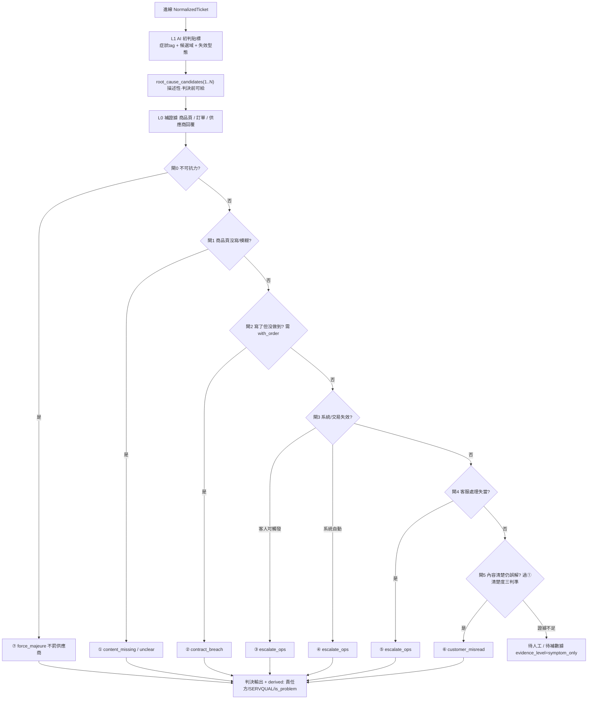

# AI 法官 問題分類層級結構（完整覆蓋版 v2）

> 綜合：6 源真實數據 + KKday 既有 29 列症狀 taxonomy + 子1~子7 架構 + 業界權威標準（多 agent 深度分析，2026-06-26）。
> 目標：一套**完整覆蓋當前所有問題**、多維 faceted、按證據分階段的分類層級。
> 取代/升級：`分類框架-完整對照表.md`（6域舊版）、`症狀-歸因映射表.md`（併入本文 §橋接）。

## 〇、圖解：分類樹狀圖 + 判決流程圖

### 圖 1 · 分類維度總樹（雙軸雙階段）


### 圖 2 · 歸因域樹（7 域 + 子類，僅①深鑽）


### 圖 3 · 跨源症狀樹（tag1 6 大類 → tag2，既有3+補齊3）


### 圖 4 · 判決流程圖（互斥判準金字塔：症狀 → 唯一歸因域）


### 圖 5 · 商品類別 × 歸因域 適用矩陣（✓高頻 △偶發 ✗不適用）
| 商品類別 ＼ 歸因域 | ①內容 | ②供應商履約 | ③訂單 | ④平台 | ⑤客服 | ⑥客人 | ⑦不可抗力 |
|---|:--:|:--:|:--:|:--:|:--:|:--:|:--:|
| 數位通訊 eSIM/SIM/Wifi | ✓ | △ 無現場·網路品質 | ✓ | △ | △ | ✓ | ✗ |
| 交通接送 機場接送/包車 | ✓ | ✓ 司機/車輛 | ✓ | △ | △ | ✓ | △ 航班/天氣 |
| 玩樂體驗 活動/票券/行程 | ✓ | ✓ 導遊/設備/安全 | ✓ | △ | △ | ✓ | ✓ 天氣取消 |
| 餐飲 F&B | ✓ | ✓ 餐點/訂位 | ✓ | ✗ | △ | △ | ✗ |
| 住宿 | ✓ | ✓ 房況/設施 | ✓ | △ | △ | △ | △ |
| 行政服務 簽證/代辦/行李 | ✓ | △ 代辦進度 | ✓ | △ | ✓ 進度查詢 | △ | ✗ |
| 優惠其他 | △ 文案 | ✗ | △ | ✓ 優惠券/活動 | △ | △ | ✗ |

> **關鍵用途**：eSIM/數位商品**無 ② 現場履約**，故 Rule R1(行程)/R2(集合) 不適用 → 禁對 eSIM 觸發 content_missing（防假陽性）；優惠類主集中 ④；行政服務主集中 ③⑤。Rule ID 需標「適用商品類型」。

### 圖 6 · 旅程階段 × 歸因域 熱區矩陣
| 旅程階段（佔比） | 熱區歸因域 | 典型問題 |
|---|---|---|
| 探索 / 預訂（售前） | ①④⑥ + pre_sale_inquiry | 商品諮詢 / 購買流程 bug / 誤解 / 推薦商品 |
| 行前 Pre-trip（69.1%）| ③①④ 🔥 | 訂單確認憑證 · 集合兌換聯絡資訊 · 通知未收到 |
| 行中 In-trip（19.5%）| ②⑦⑤⑥ 🔥 | 司機導遊設備 · 天氣取消 · 即時客服 · 去錯地點 |
| 行後 Post-trip（10.2%）| ②③⑤ | 品質投訴評論 · 退款發票 · 補救 SOP |

> **關鍵用途**：②供應商履約集中在**行中**（但證據要等行後評論才齊）；行前是量最大階段(69%)且以 ③① 為主 → dashboard 預設視角應落行前；⑦不可抗力幾乎只在行中。

## 一、五條設計原則（多 agent 共識）

1. **Faceted 多軸，非單一深樹**：一筆問題＝一組正交維度值（避免單樹組合爆炸）。
2. **按證據兩階段**：進線描述軸（判決前可觀察）⊥ 判決歸責軸（需商品頁/訂單證據）。〔Agent C P0：現框架把兩者混在同階段〕
3. **正交去冗餘**：移除共線維度——`responsible_party` 改由歸因域推導、`failure_type`(進線描述) 與 `verdict`(判決決定) 以階段區隔不重複存。〔Agent C P1〕
4. **完整跨源覆蓋**：症狀樹必須 union 全 6 源，補齊 Looker 漏掉的 ②現場履約/④平台/⑤客服/行中體驗。〔Agent B：17 類盲區〕
5. **權威接地**：階段(Travelport/ABTA)、歸責(多智體客訴研究/GetYourGuide)、產品(Arival)、根因(Ishikawa 4S/SERVQUAL)、工單(ITIL CTI)。〔Agent A〕

## 二、總架構（雙軸雙階段 + 橋接金字塔）

```
═══ 軸 A：進線描述軸（判決前可給 · 描述性 · intake_vector）═══
A1 旅程階段      探索 / 預訂 / 行前 / 行中 / 行後          ← Travelport 6-stage·ABTA
A2 商品類別 ★新   數位通訊 / 交通接送 / 玩樂體驗 / 餐飲 / 住宿 / 行政服務 / 優惠其他  ← Arival·bd_tag
A3 症狀樹        tag1 › tag2 › tag3（KKday 既有 + 跨源擴充，見 §四）  ← KKday進訊·ITIL CTI
A4 來源管道      chatbot/order_message/freshdesk/review/app_feedback/mixpanel
A5 失效型態      缺漏 / 矛盾 / 模糊 / 不符 / 未達 / 誤解（觀察到的缺陷形態）
                          │
              ═══ 橋接：互斥判準金字塔（依序問，落唯一域）═══
              症狀 → 候選歸因域{1..N} → 依證據收斂單一域（見 §五）
                          ▼
═══ 軸 B：判決歸責軸（判決後 · 歸責性 · judgment_vector · evidence-gated）═══
B1 歸因域(7) ★改  ①商品內容 ②供應商履約 ③訂單交易 ④平台系統 ⑤客服營運 ⑥客人理解 ⑦不可抗力
B2 子類/深鑽      各域子類；僅① 深鑽 8面向→60欄→Rule ID（R1-1~R5-5）
B3 SERVQUAL ★新   可靠/回應/保證/同理/有形（品質構面，exec 分析用）  ← SERVQUAL
B4 Ishikawa 4S    Suppliers/Systems/Skills/Surroundings（根因軸，分析用）  ← Ishikawa
B5 責任方(derived) 供應商/平台/客服/PM/客人/無(不可抗力)（由 B1 lookup，僅①需區分供應商內容vs PM）
B6 verdict(8)     content_missing/unclear/real_config_issue/contract_breach/escalate_ops/customer_misread/force_majeure★/pre_sale_inquiry★
B7 嚴重度         P0–P3
B8 信心度+證據    confidence(0-1) + evidence_level: symptom_only→with_product_page→with_order→with_both→with_supplier_reply ★新
```

## 三、軸 B1：7 歸因域（6域 + 新增 ⑦不可抗力）

| 域 | 範圍（含補齊的盲區）| 責任方 | verdict | 最低證據門檻 |
|---|---|---|---|---|
| ① 商品內容 | 8 面向：商品定位/行程流程/費用/集合/兌換/成團/限制風險/承諾SLA | 供應商內容 + PM法典 | content_missing/unclear/real_config | with_product_page |
| ② 供應商履約 ★最大盲區 | 現場人員 + 集合執行 + 語言 + 成團履約 + **設備車餐 + 安全SOP + 餐飲品質 + 衛生 + 行程縮水 + 臨時停辦** | 供應商現場 | contract_breach | **with_order**（無訂單→降候選） |
| ③ 訂單交易 | 訂單確認/修改/取消/退款/付款/憑證單據 | 平台/客服 | escalate_ops | with_order |
| ④ 平台系統 ★盲區 | App bug/搜尋推薦/流程/通知失效/行銷優惠 + **帳號登入 + 推播廣告 + 表單體驗 + 優惠券領取** | 平台 RD/PM | escalate_ops | 系統紀錄 |
| ⑤ 客服營運 ★僅判決層 | 回應SLA/態度/補救SOP/跨單位 + **無法聯繫客服** | 客服/營運 | escalate_ops | with_supplier_reply/客服紀錄 |
| ⑥ 客人理解 | 內容清楚仍誤解/期待過高/看錯方案/未讀注意 | 客人(非問題) | customer_misread | with_product_page（須證①不成立）|
| ⑦ 不可抗力 ★新 | 天災/疫情/罷工/惡劣天氣/政治事件（GetYourGuide severe vs isolated）| 無(非雙方責) | force_majeure | 外部事件佐證 |

**關鍵修正**（對應 Agent C）：
- **⑦ 不可抗力獨立**：原埋在 ⑥，但歸責性質不同（非任何方過失、補償路徑不同），業界(GetYourGuide/ABTA)均獨立切分。
- **⑤ 標註「判決層專屬」**：症狀層無對應 tag，禁排入進線候選集，須有客服紀錄佐證才寫入。
- **⑥ 標註「①的補集」**：須先證 ① 不成立才可判 ⑥；①→⑥ 閘門加清楚度三判準（有Rule對應且填寫完整 / 無同類客訴史 / 同商品他客未提）。
- **③④ 邊界非工程師判準**：客人頁面可觸發=③ / 系統後台自動=④。

## 四、軸 A3：完整跨源症狀樹（KKday 既有 + 補齊盲區）

KKday 既有 3 個 tag1（訂單導向）**＋ 補 3 個 tag1**（跨 app_feedback/mixpanel/review 補齊現場與平台），達成完整覆蓋：

```
【既有·訂單導向】（來源：chatbot + order_message，Looker 29 列）
1. 訂單/憑證/單據 (83.1%) ─ 訂單確認問題/訂單申請修改/訂單取消/單據發票收據
2. 商品資訊確認與商品體驗過程 (21.57%) ─ 商品資訊確認/現場工作人員/商品使用體驗
3. 付款與交易 (3.36%) ─ 購買過程與交易問題/行銷優惠相關

【新增·補齊盲區】（來源：app_feedback/mixpanel/review，Looker 缺）
4. 平台與系統 ★新 ─ App錯誤/閃退 · 速度慢 · 帳號登入(含亞萬) · 通知推播/廣告騷擾 · 搜尋推薦差 · 表單重複輸入 · 優惠券領取失敗
   （Agent B：~9,156 筆，現完全無對應）
5. 行中體驗與現場履約 ★新 ─ 找不到導遊/集合點 · 接送未到/遲到 · 餐飲品質 · 交通設備 · 語言溝通 · 行程縮水 · 安全事件 · 衛生清潔
   （Agent B：餐飲860+導遊611+交通755+臨時停辦~27k…現場類 Looker 全缺）
6. 客服與溝通 ★新 ─ 回應效率差 · 無法聯繫客服 · 處理態度 · 多次未解決
   （Agent B：app_feedback 276 筆 21.3%）
```

> 註：tag1=4/5/6 量在「進訊(chatbot/order_message)」源偏低（因該源繞訂單），但在 app_feedback/mixpanel/review 源是主體 → 完整 taxonomy 必須跨源 union，不可只用 Looker 進訊單源。

## 五、橋接：互斥判準金字塔（同症狀 → 唯一歸因域）

讓 7 域 MECE 的機制＝**依序問、先命中先落**（非各域各自定義同一現象）：

```
進線：症狀 → root_cause_candidates[]（查映射表得候選集，描述性可給）
判決：依下列順序逐閘判定唯一 root_cause_domain（每閘需對應證據）
  閘0 不可抗力？(天災/罷工/疫情/惡劣天氣)         → ⑦  [外部事件]  ★最先判（解⑦/②邊界）
  閘1 商品頁該寫沒寫/模糊？                        → ①  [with_product_page]
  閘2 內容寫了但現場沒做到？                       → ②  [with_order + 供應商回覆]
  閘3 系統/交易流程失效？ 客人可觸發=③ / 系統自動=④  [系統紀錄]
  閘4 客服處理失當？                              → ⑤  [客服紀錄]
  閘5 內容清楚客人仍誤解？(過①清楚度三判準)         → ⑥  [with_product_page]
  預設 證據不足 → 停在候選集，evidence_level=symptom_only，標「待人工/待補數據」
```

**典型裂解**（同症狀「找不到導遊/集合點」mixpanel 29 筆）：
過閘0非天災 → 閘1讀商品頁：集合資訊沒寫=① / 寫了 → 閘2讀訂單+供應商：供應商沒到=② / 都正常 → 閘5內容清楚客人沒看=⑥。**進線給 {①②⑥} 候選，判決收斂單一。**

## 六、完整覆蓋驗證（Agent B 17 盲區 → 全部歸位）

| 盲區問題 | 估量 | 新增落點（A3 症狀 → B1 域）|
|---|---|---|
| 平台/APP 系統問題 | ~9,156 | tag1-4 平台系統 → ④ |
| eSIM/網路連線 | ~8,038 | tag1-5 行中體驗(訊號)/tag1-2 商品資訊(設定) → ②+① |
| 供應商臨時停辦 | ~27,351 | tag1-5 行中履約(臨時停辦) → ② |
| 餐飲品質 | ~937 | tag1-5 行中體驗(餐飲) → ② |
| 司機/導遊品質差 | ~613 | tag1-5 行中體驗(現場人員) → ② |
| 交通設備差 | ~755 | tag1-5 行中體驗(交通設備) → ② |
| 護照/簽證諮詢 | ~1,400 | tag1-2 商品資訊(行政服務) → ①/⑥ |
| 客服回應差/無法聯繫 | ~278 | tag1-6 客服溝通 → ⑤ |
| 行程/景點縮水 | ~190 | tag1-5 行中履約(行程縮水) → ② |
| 通知推播/廣告騷擾 | ~125 | tag1-4 平台系統(推播) → ④ |
| 語言溝通 | ~85 | tag1-5 行中體驗(語言) → ② |
| 安全/緊急事件 | ~75 | tag1-5 行中體驗(安全) → ②（或⑦若不可抗力）|
| 衛生/清潔 | ~90 | tag1-5 行中體驗(衛生) → ② |
| 隱藏費用/私自加收 | ~43 | tag1-5(加收) → ②+③ |
| 行中找不到嚮導/集合 | ~39 | tag1-5 行中履約 → ② |
| APP 表單體驗差 | ~50 | tag1-4 平台系統(表單) → ④ |
| 售前諮詢/推薦商品 | ~12k | tag1-2/3(諮詢) → verdict=pre_sale_inquiry(非問題)|

✅ 17 盲區全部有落點；6 源全覆蓋。

## 七、權威維度對照（Agent A）

| 本架構維度 | 業界權威出處 |
|---|---|
| A1 旅程階段 | Travelport 六階段 / ABTA 三分期 |
| A2 商品類別 | Arival Experiences Taxonomy（4 層 343 類）/ Nyckel 10 垂直 |
| A3 症狀樹 | KKday 進訊 / ITIL CTI（Category→Type→Item 三層）/ SentiSum 30-50 標籤 |
| B1 歸因域 7 | 多智體客訴歸責研究(4 失敗群組) / Ishikawa 4S / GetYourGuide(含⑦不可抗力) |
| B3 SERVQUAL | Parasuraman et al. 1988（5 構面）|
| B4 Ishikawa 4S | Suppliers/Systems/Skills/Surroundings |
| B5 責任方 | Marketplace 三方歸責 / Booking.com issue reporting |
| B7 嚴重度 | ITIL Priority Matrix(Impact×Urgency) |

## 八、schema 落地（兩階段，去冗餘）

```
# intake_vector（進線寫入，描述性）
symptom_tag1/2/3 · trip_stage · product_category(bd_tag) · source_channel · failure_type · root_cause_candidates[]

# judgment_vector（判決寫入，evidence-gated）
# ★ LLM 實際只輸出 5 欄：root_cause_domain · sub_cause · verdict · severity · confidence
root_cause_domain(7) · sub_cause · dimension(8)/suspected_field(60)/hit_rule_id · verdict(8) · severity · confidence · evidence_level
responsible_party = DERIVED(root_cause_domain)   # 決策#5：lookup；僅 ① 由 LLM 區分 供應商內容/PM
servqual_dim      = DERIVED(domain + sub_cause)  # 決策#4：derived 可選，非 LLM 必填
ishikawa_4s       = DERIVED(domain + sub_cause)  # 決策#4：derived 可選
is_problem        = (verdict NOT IN {pre_sale_inquiry})  # 決策#3：售前諮詢排除問題率分母

# 硬閘規則
- evidence_level < with_order ⇒ root_cause_domain ≠ ② 且 verdict ≠ contract_breach（強制降候選）
- root_cause_domain = ⑤ ⇒ 須有客服紀錄；禁進進線候選集
- verdict = content_missing ⇒ writer_handoff = false（對齊子5 防幻覺鐵則）
- verdict = pre_sale_inquiry ⇒ is_problem = false（不計入問題率 KPI 分母）
- verdict = force_majeure ⇒ responsible_party = 無；不罰供應商、不計商品問題
```

## 九、與既有架構銜接（子1~子7 / L0-L5）

- **L1 intake（子2 §九）**：AI 初判只填 intake_vector（症狀+候選域+失效型態），不 commit 單一域。
- **L0 DB（子4）**：fetch_product/fetch_order 提供 evidence_level 升級的證據；extract_fields 9→60 欄缺口仍是 ① 深鑽風險。
- **L2-L4 判決鏈（子5）**：跑互斥判準金字塔，填 judgment_vector，evidence 硬閘防 ② 假陽性。
- **L5 dashboard（子3）**：進線漏斗(A1/A3)→歸因下鑽(B1 pie/責任方)→8面向×verdict 熱力→Rule Top-N→**分類成熟度(已判決/待證據/待人工)**。

## 十、PM 決策（已定版 2026-06-26）

> 共同邏輯：**能由規則推導的就別讓 LLM 判（去冗餘+降幻覺）；語義/補償路徑不同的就獨立（不污染統計）。** 定版後 LLM 判決階段只輸出 5 欄。

1. **#1 ⑦不可抗力 → 獨立成域**（補償走保險/政策、不罰供應商、不算商品問題；⑦/②邊界由金字塔閘0先判）
2. **#2 ③④ → 維持分離**（④量大~9k、owner 不同；判準：客人可觸發=③ / 系統自動=④）
3. **#3 pre_sale_inquiry → 獨立 verdict ＋ is_problem=false**（售前諮詢非問題，從問題率 KPI 分母排除）
4. **#4 SERVQUAL / Ishikawa 4S → derived 可選**（分析鏡頭、與歸因域共線，由 domain+sub_cause 推導，非 LLM 必填）
5. **#5 responsible_party → 改 derived**（由 domain lookup；唯一例外 域=① 時 LLM 區分 供應商內容/PM法典）

## 十一、信心度漸進模型（signal-driven，0-10）

### 核心觀念
1. **不準的是「歸因」不是「症狀」**：症狀分類(軸A)進線即準(~8-9)；歸因判決(軸B)進線不準(~2-4)，要漸進提升的是後者。dashboard 可進線即顯示症狀分布、歸因標 tentative。
2. **信心度是信號驅動，非階段驅動**：`order_message` 進線時 `aggregated_messages` 已含完整客服/供應商對話 → 有些高價值證據「最前期」就在手裡。信心度＝「湊齊哪些信號」而非「走到第幾步」。

### 0-10 計分模型
```
信心度 = 起評分(症狀指向性) + Σ信號加權 − 衝突扣分，受「缺證據封頂」約束

起評分 base：候選域>1 → 3 ｜ 症狀強指向單一域(如App閃退→④) → 5
信號加權(+)
  S1 客服/供應商「明確下結論且一致」..... +3  ★最高權重(接近 ground truth)
  S2 商品頁讀取·目標欄位明確有寫/缺漏... +2
  S3 訂單數據佐證(時間/地點/狀態/履約).. +2
  S4 客人自述「自己解決了/我看錯了」.... +2 (強指⑥/非問題)
  S5 多源跨管道一致(評論+進線+mixpanel) +1
  S6 結案標記/滿意度(st_survey_rating). +1
衝突扣分(−)：證據矛盾(客服說A·商品頁說B) −2 且標 needs_human ｜ 客服未下結論 不加分
缺證據封頂：①無商品頁→≤5 ｜ ②無訂單/供應商回覆→≤4 ｜ ⑤無客服紀錄→不得判⑤
```

### 漸進累積（單調遞增，一致證據往上加、矛盾才下調）
「找不到集合地點」進線(候選{①②⑥})：base 3 → 客服回覆「集合點X·商品頁有寫」S1+3 → 6(指⑥) → 讀商品頁確認填寫清楚 S2+2 → 8 → 收斂 ⑥ customer_misread 自動採信。
（對照：客服「確實沒寫·已請供應商補」S1+3 指① → 讀頁確認缺漏 S2+2 → 8 → ① content_missing 派 PM/供應商修頁。）

### 分層 → dashboard 三態 + action 觸發
- 信心 ≥8：自動採信 → 派 action owner
- 信心 5-7：待覆核 → 人工抽查佇列
- 信心 <5：待補/待人工 → 回候選集，dashboard 標「待證據」

### evidence_level 關係
`evidence_level`(離散·拿到哪些數據) 是 confidence 封頂規則的輸入；`confidence`(0-10 連續·綜合判定可信度) 是給 dashboard/action 的單一分數。並存非冗餘。

## 十二、最終產出 = 最細節問題 + action 角色（對齊 v3 判定層/執行層）

| 歸因域 | verdict | v3 判定層 | action owner（誰修，≠歸責方） |
|---|---|---|---|
| ①商品內容(缺/錯) | content_missing/unclear/real_config | 第1層(欄位不合規)/第2層(框架未定義) | 供應商(SCM2.0改頁)+AM/BD盯+PM修法 |
| ②供應商履約 | contract_breach | 第3A層(承諾未達) | 計點+SCM2.0+AM/BD |
| ③④⑤ | escalate_ops | 第3B層(非內容履約) | 客服/營運 協作 |
| ⑥客人理解 | customer_misread | （非問題） | 客服釋疑 / 無 |
| ⑦不可抗力 | force_majeure | （非問題） | 客服 / 保險 |

> **歸責方 ≠ action owner**：①內容歸責「供應商內容+PM」，但動手改的可能是 PM(修法)/AM·BD(盯)/供應商(SCM2.0改頁)。故判決帶兩欄：`responsible_party`(誰錯) + `action_owner`(誰修)。**最細節問題** = symptom tag3 →（①深鑽）suspected_field/Rule ID（對齊治理規則庫 Rule ID）。

## 對應 Confluence
SSOT 頁面：https://kkday.atlassian.net/wiki/spaces/VM/pages/2137915398（父頁 AI 法官 V2 2125561898 之子頁）。
```
